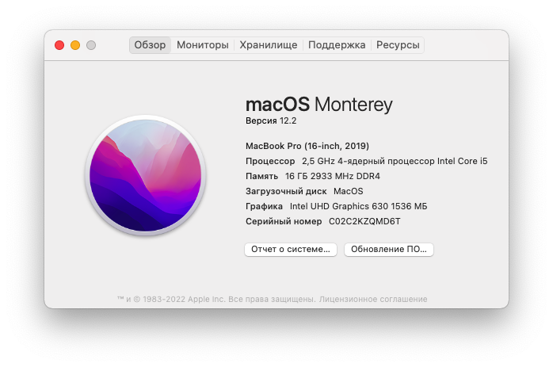

# [SUCCESS] Acer-Nitro-5-AN515-55

# macOS Monterey: версия 12.2

Проект был создан с нуля с помощью [Opencore - Dortania Guide](https://dortania.github.io/OpenCore-Install-Guide/).
 Огромное спасибо удивительному сообществу за документацию.

`Opencore Version: 0.7.5` 

## Localizations

- English: [here](./readme.md)
- Russian: you are here.

## Оглавление

- [Спецификации](#Спецификации)
- [Статус работоспособности](#Статус-работоспособности)

## Спецификации

| Спецификация       | Детали                                    |
|--------------------|-------------------------------------------|
| Модель             | Acer Nitro 5 - AN515-55-534C (RTX3050)    |
| Процессор          | Intel(R) Core(TM) i5-10300H CPU @ 2.50GHz |
| ОЗУ                | 16.00 GB                                  |
| Встроенная графика | Intel(R) UHD Graphics 630                 |
| Экран              | FHD 1920x1080 (15.6, 144Гц)               |
| Модем              | Intel(R) AX 201                           |

* Протестировано на:

* ✓ Acer Nitro 5 - AN515-55-559T (GTX1650ti)
* ✓ Acer Nitro 5 - AN515-55-534C ( RTX3050 )

## Статус работоспособности

|       Компонент        | Статус |
|:----------------------:|:------:|
| Дискретная видео карта |   ☓    |
|         Тачпад         |   ✓    |
|          Звук          |   ✓    |
|         Wi-FI          |   ✓    |
|       Bluetooth        |   ☓    |
|          HDMI          |   ☓    |
|     Type-c -> HDMI     |   ☓    |

- **Всё остальное работает отлично**

> Совет: Если не работает в наушниках звук используйте `ALCPlugFix`
> 
> Совет: если тачпад работают не корректно, то можно поиграться с настройками в разделе `трекпад`

## **Если вам понравился проект, оцените его звёздочкой ⭐**

> При установке стандартный язык: Бразильский, однако, его можно сменить вручную.

Если у вас есть сложности, обращайтесь ко [мне](https://t.me/santaspeen).
 Помогу чем смогу
